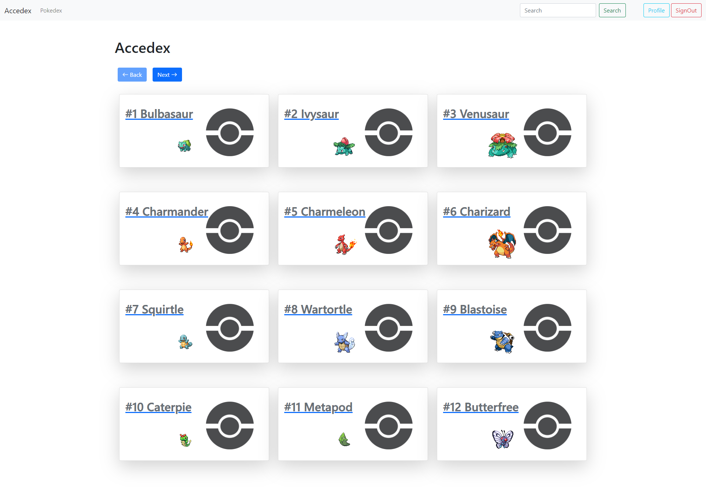

# Formación en Accenture - Víctor

En este documento se podrá ver un *preview* de todos los proyectos que he ido realizando durante mis prácticas en Accenture. 

Todos los proyectos tienen como base "atacar" a una API pública (en mi caso una muy faamosa sobre [Pokemon](https://pokeapi.co/)), y utilizar [*FireBase*](https://firebase.google.com/) de Google para poder crear un inicio se seción y guardar datos de una forma más sencilla.

## Angular

## Ionic

## React
